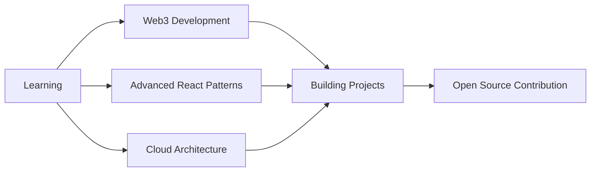

<div align="center">
  
# 👋 Hey there! I'm Ethan Jericho Salvador

[](https://git.io/typing-svg)


[](https://visitcount.itsvg.in)

</div>

---

## 🚀 About Me

```typescript
const ethan = {
    location: "Bayombong, Nueva Vizcaya 🇵🇭",
    education: "BS Information Technology @ Saint Mary's University",
    year: "4th Year | Class of 2026",
    role: "Front-end Stack Developer & UI/UX Designer",
    achievements: ["Bronze Medalist", "Dean's Lister", "Best Startup Idea"],
    currentFocus: ["Web Development", "Mobile Apps", "AI Integration"],
    lifePhilosophy: "Building digital solutions that make a difference 💻✨"
};
```

<div align="center">

### 🌐 Let's Connect!

[](https://www.facebook.com/ethanjericho.salvador/)
[](https://www.instagram.com/yekoslvdor/)
[](#)
[](#)

</div>

---

## 💻 Tech Arsenal

<details open>
<summary><b>🎯 Programming Languages</b></summary>
<br>


</details>

<details open>
<summary><b>🌐 Frontend Development</b></summary>
<br>


</details>

<details open>
<summary><b>⚙️ Backend & Databases</b></summary>
<br>


</details>

<details open>
<summary><b>🛠️ Tools & Platforms</b></summary>
<br>


</details>

---

## 📊 GitHub Analytics

<div align="center">
  
  
</div>

<div align="center">
  
</div>

<div align="center">
  
</div>

---

## 🏆 Achievements Showcase

<div align="center">
  


</div>

---

## 🎯 Current Focus



<div align="center">

### 🌱 Currently Learning
`TypeScript` • `Next.js` • `AWS` • `Docker` • `GraphQL` • `Flutter`

### 🎓 Recent Certifications & Training
- 🥉 **Bronze Medalist** - 1st & 3rd Year (SMU)
- 🏅 **Dean's List** - 2nd Year (SMU)
- 🚀 **Best Startup Idea** - DICT Region 2 InnovaTour 2025
- 📚 **AI Application & Implication Workshop** - National University of Singapore

</div>

---

## 💡 Random Dev Wisdom

<div align="center">


</div>

---

## 🔝 Top Contributed Repositories

<div align="center">


</div>

---

## 📈 Profile Stats

<div align="center">


</div>

---

## 🎨 Featured Projects

<div align="center">

[](https://github.com/CrankyOwl1)
[](https://github.com/CrankyOwl1)

</div>

---

## 🐍 Contribution Snake

<div align="center">


</div>

---

<div align="center">

### 💬 Get In Touch

*I'm always open to interesting conversations and collaboration opportunities!*

**Email:** [your.email@example.com](mailto:your.email@example.com)

---

### ⚡ Fun Fact

*"I can debug code faster with music on 🎵"*

---


**Thanks for visiting! Let's build something amazing together! 🚀**


---

[](https://visitcount.itsvg.in)

</div>

---

<div align="center">

*💙 Crafted with passion and countless cups of coffee ☕*

**"Code is like humor. When you have to explain it, it's bad." – Cory House**

</div>

<!-- Proudly created with ❤️ -->
